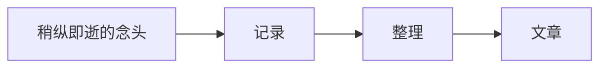

欢迎来到半醒观测站。

这里不是一间时刻保持清醒的实验室，更像是校园顶楼一座亮到深夜的小小观测台。它记录技术实践，也保存生活里偶然出现的念头。

## 为什么重建博客

一个博客的价值不在于堆叠多少功能，而在于能否让写作和阅读都足够自然。这次重构保留了搜索、归档、标签、代码高亮、数学公式和图表等真正服务内容的能力，也移除了与写作无关的展示页面。

> [!NOTE]
> 第一版优先保证阅读体验、国内访问稳定和后续维护简单。

## 技术底座

站点使用 Astro 生成静态页面，Svelte 负责少量需要状态的交互组件。

```ts
const observatory = {
  name: "半醒观测站",
  principle: "写作体验优先",
  status: "持续观测中",
};
```

阅读时间由构建阶段计算。公式与图表也在 Markdown 中直接维护，例如：

$$
L = \sum_{i=1}^{n} m_i
$$



## 接下来

这里会逐渐出现更多关于开发、工具和生活的观察。内容不必宏大，只要真实、清楚，并且值得在未来重新读到。
